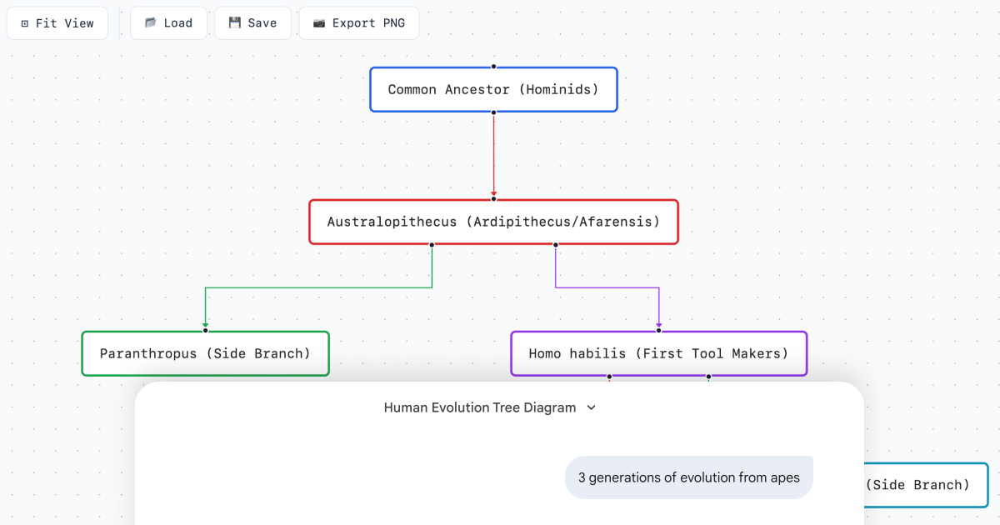

# GraphMaker

<p align="center">
  
</p>

An LLM-friendly tool for visualizing and editing flowcharts and tree diagrams.

This app was 100% vibe coded with opus 4.5 in under an hour.

<p align="center">
<a href="https://graph-maker.site"></a>
</p>

<p align="center">
<a href="https://gemini.google.com/gem/1iacXBByzAxhWjs-bIMprxGnhOYCBBM-a"></a>
</p>

## Why

Imagine that you drew a graph during a meeting. It looks cool. You want to work with it.

Graph Maker exposes a simple to understand API that makes it easy for LLMs to distill the information from your photo\graph (pun intended).


## Features

- **Create with Gemini** — Lets Google Gemini build the graph data for you
- **Create from Table** — Opens a table editor that lets you manually input the data
- **Save \ Load CSV** — Loads and saves existing graph data as CSV tables
- **Visual Editor** — Drag nodes to reposition, with smart snapping
- **Export** — Export graph as PNG

## CSV Format

```csv
0,Root,1;2
1,Foo,3
2,Bar,3
3,Buzz,
```

| Column     | Description                          |
| ---------- | ------------------------------------ |
| `id`       | Unique node identifier               |
| `label`    | Display text                         |
| `children` | Child node IDs (semicolon-separated) |

## Local Development

```bash
bun install
bun dev
```

## License

MIT
